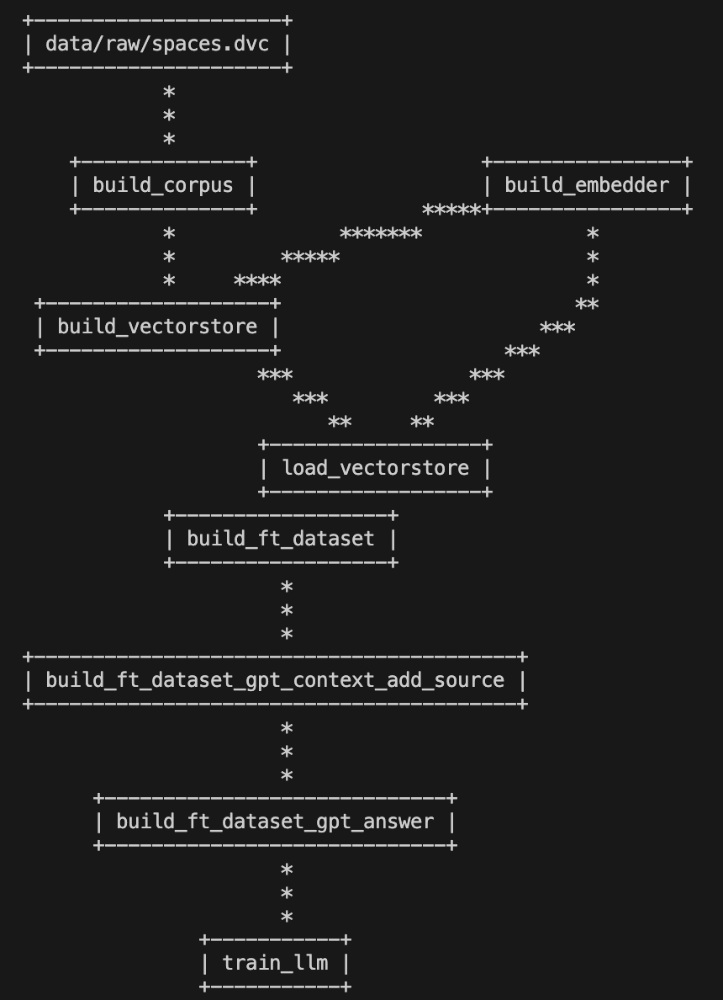

# LLM Question Answering 🤖❓

This repository hosts the code for the RAG-based question answering component of the Data Chatbot challenge. It focuses on using instruction-tuning to enhance various open-source language models for the specific task of question answering. The models developed are tested both quantitatively and qualitatively with a range of contexts and questions. The most effective model is subsequently integrated into the [Study Bot Implementation](https://github.com/NLP-Challenges/Study-Bot), serving as the foundation for its question-answering capabilities.

The fine-tuning process utilizes a Data Version Control (DVC) pipeline, ensuring reproducibility and streamlined workflow management.

Our models are trained on CUDA-enabled GPUs using the `bitsandbytes` library, which requires CUDA-compatible hardware for optimal performance. The fine-tuning configurations are managed through `params.yaml`, allowing for easy adjustments and experimentation.

The fine-tuned models are published under the [nlpchallenges organization on Hugging Face](https://huggingface.co/nlpchallenges). You can find the models specific to this project at [nlpchallenges/chatbot-qa-path](https://huggingface.co/nlpchallenges/chatbot-qa-path).

## Repository Structure

The structure of this repository is organized as follows:

```markdown
└── 📁llm-qa-path
    └── .env.template [ℹ️ Template for .env file]
    └── requirements.txt
    └── README.md
    └── 📁eda notebooks [ℹ️ Contains notebooks for exploratory data analysis]
    └── 📁extractor [ℹ️ Contains notebook to extract spaces data for vectorstore]
    └── dvc.lock [ℹ️ DVC lock file to ensure reproducibility]
    └── dvc.yaml [ℹ️ DVC pipeline configuration file]
    └── params.yaml [ℹ️ DVC params file for run configs]
    └── 📁src
        └── 📁stages [ℹ️ DVC pipeline stages]
    └── 📁data [ℹ️ DVC data folder]
        └── 📁models [ℹ️ Contains the resulting models post-training]
        └── 📁processed [ℹ️ Contains DVC stages processed data]
        └── 📁raw [ℹ️ Contains input files for the DVC stages]
    └── evaluation_question_answering.ipynb [ℹ️ Notebook for evaluating the models (NPR MC2)]
    └── test_context.json
```

## Setup

### Prerequisites

1. **Clone the Repository**: Clone this repository to your local machine.
2. **Python Environment**: Create a new virtual Python environment to ensure isolated package management (we used Python 3.11.6).
3. **Installation**: Navigate to the repository's root directory and install the required packages:
   ```bash
   pip install -r requirements.txt
   ```
4. **DVC Pull**: Pull the DVC data from the remote repository:
   ```bash
   dvc pull
   ```
   This command will download the data and models from the data remote repository to your local machine. Make sure you have permission to access the Google Drive folder. To request acccess, contact <tobias.buess@students.fhnw.ch> with your E-Mail.

### Configuring Environment Variables

1. **Environment File**: Copy `.env.template` to a new file named `.env`.
2. **API Keys**: Add your API keys and tokens in the `.env` file:
   ```
   HF_ACCESS_TOKEN=your-token-here
   HF_ACCESS_TOKEN_WRITE=your-token-here
   OPENAI_API_KEY=your-key-here
   ```
   Replace `your-token-here` and `your-key-here` with your actual Hugging Face and OpenAI API keys.

### Using the DVC Pipeline

The repository uses a DVC pipeline for model fine-tuning. This approach allows for version control of data and models, ensuring reproducibility and efficient experimentation.

1. **Configuration**: The fine-tuning process is controlled by the `params.yaml` file. Adjust the parameters in this file to customize the training process.
2. **Running the Pipeline**: To run the DVC pipeline, use the following command:
   ```bash
   dvc repro
   ```
   This command will execute the pipeline stages defined in `dvc.yaml`, using the configurations specified in `params.yaml`.

## DVC Stages

Here is a brief overview of the DVC stages used in this project, and what purpose they serve:



### Retrieval stages

Purpose of the retrieval stages is to create chunks from relevant documents (Data Science study program documents, course materials etc.) and save them in a ChromaDB vector store, which we can later query for relevant documents given a question. The resulting ChromaDB vector store is directly used in the Chatbot implementation which can be found in the [Study Bot Repository](https://github.com/NLP-Challenges/Study-Bot).

- build_corpus: Chunk the data in `data/spaces` folder (PDFs and spaces.parquet) and save as `corpus.jsonl` in preparation for embedding.
- build_embedder: Create and save the embedder model for later use.
- build_vectorstore: Load the chunked data from `corpus.jsonl` into ChromaDB.
- load_vectorstore: Load and query the ChromaDB vectorstore. We always query the top 4 most relevant chunks for the given question using `similarity_search()`, which is based on cosine distance.

### Fine-tuning stages

The aim of the fine-tuning process is to enhance a language model's proficiency in question answering. We utilize the GermanQUAD dataset, a curated and human-labeled German question-answering resource, as our foundational material. This dataset comprises questions and their corresponding contexts—extracted from Wikipedia articles—as well as answers that are directly sourced from these contexts, rendering them extractive in nature. However, our objective is to train a language model to consistently generate appropriate, abstractive answers. To transform the answers from extractive to abstractive, we employ GPT-3.5 to create suitable responses. Additionally, recognizing that some queries in a real-world setting may be unanswerable with the provided context, it's crucial to include training examples where the model informs users of its inability to answer due to current knowledge limitations. We facilitate this by swapping a portion of the dataset's context between questions (based on the `frac_swapped=0.5` parameter) and leveraging GPT-3.5 to formulate appropriate responses of non-answering.

- build_ft_dataset: Perform train, val, test split. Load germanquad dataset, preprocess and swap context for a given fraction of the data.
- build_ft_dataset_gpt_context_add_source: Split content into chunks and generate reasonable sources using GPT-3.5 for each chunk.
- build_ft_dataset_gpt_answer: Let GPT-3.5 answer the questions, either informing the user that the question is not answerable (context swapped) or generating an adequate, abstractive answer (context not swapped).
- train_llm: Fine-tune the LLM model on the generated dataset.

## Retrieval

This chapter outlines the retrieval methods and technologies used, including the decision to employ ChromaDB and the implementation of alternative retrieval strategies.

### ChromaDB: Choice and Advantages

We chose ChromaDB for our document retrieval needs due to its several compelling features:

- **Fast and Efficient**: ChromaDB is designed for high-speed retrieval, making it ideal for our use case of real-time chatbot interactions.
- **Open Source**: It is open source and free to use.
- **File System-Based**: This makes it easy to use, without needing to set up a database server.

### How ChromaDB Works

ChromaDB employs *cosine distance* as its primary metric to assess the relevance of documents in response to a query. This method differs significantly from cosine similarity, commonly used in many information retrieval systems.

#### Cosine Similarity vs. Cosine Distance

Cosine similarity measures the cosine of the angle between two non-zero vectors in a multidimensional space. It is defined as:

$$
\text{Cosine Similarity}(\mathbf{A}, \mathbf{B}) = \frac{\mathbf{A} \cdot \mathbf{B}}{\|\mathbf{A}\| \|\mathbf{B}\|}
$$

where $\mathbf{A}$ and $\mathbf{B}$ are vectors, $\mathbf{A} \cdot \mathbf{B}$ is their dot product, and $\|\mathbf{A}\|$ and $\|\mathbf{B}\|$ are their magnitudes.

In contrast, cosine distance measures the dissimilarity between two vectors based on the cosine of the angle between them. It can be derived from cosine similarity as follows:

$$
\text{Cosine Distance}(\mathbf{A}, \mathbf{B}) = 1 - \text{Cosine Similarity}(\mathbf{A}, \mathbf{B})
$$

This formula implies that as the cosine similarity increases (vectors are closer in orientation), the cosine distance decreases, indicating a smaller difference between the vectors.

#### Application in ChromaDB

In ChromaDB, the cosine distance is used to rank document chunks by calculating the distance between the vector representation of the user's query and the vector representations of document chunks in the database. The vectors are embeddings of the text content, capturing semantic information. Document chunks with the smallest cosine distances to the query are considered the most relevant and are returned as search results.

This approach enables ChromaDB to rank document chunks based on how closely their content matches the user's query. In the `load_vectorstore` stage, we query the top 4 most relevant chunks for the given question using `similarity_search()`, which is based on cosine distance.

## Dataset, Models and Experiments

### Fine Tuning Dataset

Our fine-tuning dataset is constructed from the GermanQUAD dataset, using the Fine-tuning related stages in the DVC pipeline. The dataset is split into training, validation, and test sets, with 50% of the questions being answerable with the provided context, and 50% being unanswerable.

- Dataset Source: https://huggingface.co/datasets/deepset/germanquad
- Download: 22.12.2023
- Abstractive dataset modification with Pipeline: 22.12.2023

The dataset includes the following sample size:

- Training: 4000 samples
- Validation: 500 samples
- Test: 200 samples

### Fine Tuning Models

We ran three different experiments, each using a different language models from Hugging Face's model hub. We used the same training data built by the `build_ft_dataset*` stages in the DVC pipeline for all three experiments. For hyperparameter details, check the `params.yaml` file in each of the branches linked below.

### Baseline: meta-llama/Llama-2-13b-hf

Our Baseline experiment uses the original Llama-2-13b model released by Meta. This model is not specifically optimized for German, but rather a general-purpose language model. We use this model as a baseline to compare the performance of the other two models.

- Model Source: https://huggingface.co/meta-llama/Llama-2-13b-hf
- Download: 23.12.2023
- Experiment Branch: https://github.com/NLP-Challenges/llm-qa-path/tree/baseline_model

### flozi00/Llama-2-13b-german-assistant-v7

Our second experiment uses a German-optimized version of the Llama-2-13b model. This model is trained on a large German dataset, and is specifically optimized for on instruction following and conversational tasks.

- Model Source: https://huggingface.co/flozi00/Llama-2-13b-german-assistant-v7
- Download: 22.12.2023
- Experiment Branch: https://github.com/NLP-Challenges/llm-qa-path/tree/german_llama2

### VAGOsolutions/SauerkrautLM-7b-v1-mistral

Our third experiment uses a German-optimized version of the Mistral-7b model. This model is trained on a large German dataset, and was trained with a mix of German data augmentation and translated data.

- Model Source: https://huggingface.co/VAGOsolutions/SauerkrautLM-7b-v1-mistral
- Download: 29.12.2023
- Experiment Branch: https://github.com/NLP-Challenges/llm-qa-path/tree/german_mistral

## Evaluation

To be able to provide accurate answers to the questions, it is essential that the chunks retrieved from the vectorstore are actually relevant to the question. Thus, we evaluated the retrieval performance in the notebook [evaluation_retrieval.ipynb](evaluation_retrieval.ipynb).

Based on the three LLM fine-tuning experiments, we evaluated the question answering of the models in the notebook [evaluation_question_answering](evaluation_question_answering.ipynb) (NPR MC2). 

## Conclusion

The model that performed best in our evaluation was based on `VAGOsolutions/SauerkrautLM-7b-v1-mistral`, thus we ended up using in the [Study Bot Implementation](https://github.com/NLP-Challenges/Study-Bot).
